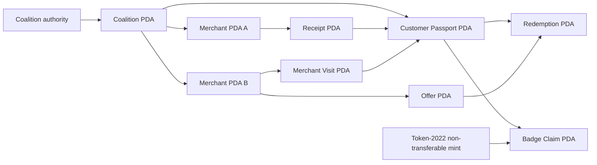

# Alliance Passport

Alliance Passport is a coalition loyalty protocol on Solana. Independent
merchants issue points from authenticated purchase receipts, customers grow a
shared balance across the coalition, and offers can be earned at one merchant
and redeemed at another.

The protocol's differentiator is a breadth multiplier: each distinct merchant
visited adds a 2.5% bonus to future points, capped at 15%. A receipt PDA makes
every purchase idempotent, and earned tier badges use Token-2022's
`NonTransferable` extension so status cannot be traded away from its owner.

## Status

- Network: local validator tested; devnet deployment pending
- Live client: https://santozion17-afk.github.io/alliance-passport/
- Repository: https://github.com/santozion17-afk/alliance-passport
- Framework: Anchor 0.32.1
- Solana CLI: 2.3.0
- Program ID: `2z8tVq9DT8DUnKf8UY2ZDSWBatePKXtXhY4HQXbwfGkE`
- Token program: Token-2022
- Bounty: [On-Chain Loyalty Rewards System Challenge](https://superteam.fun/earn/listing/on-chain-loyalty-rewards-system-challenge)

## What is included

- Complete Anchor program with ten public instructions.
- Coalition, merchant, passport, visit, receipt, offer, redemption, badge, and
  claim PDAs.
- Checked point and tier arithmetic with focused Rust tests.
- End-to-end local-validator test covering two merchants, replay rejection,
  cross-merchant redemption, and a non-transferable Token-2022 badge.
- Responsive React client for passport, network, offer, provenance, and
  architecture views.
- Reproducible GitHub Actions checks and a manual devnet deployment route.

## Architecture



See [ARCHITECTURE.md](./ARCHITECTURE.md) for the account contract and protocol
invariants.

## Local setup

Prerequisites:

- Rust 1.89.0
- Solana CLI 2.3.0
- Anchor CLI 0.32.1
- Node.js and pnpm

Install JavaScript dependencies:

```bash
pnpm install --ignore-scripts
pnpm --dir app install --ignore-scripts
```

Build and run the protocol tests:

```bash
anchor build
pnpm test:program
```

Build and preview the client:

```bash
pnpm --dir app build
pnpm --dir app preview
```

## Point calculation

Base points use USDC minor units:

```text
base_points = spend_minor * points_per_usdc / 100
bonus_bps = min(max(unique_merchants - 1, 0) * 250, 1500)
total_points = base_points + base_points * bonus_bps / 10000
```

All arithmetic is checked. Zero-value purchases, all-zero receipt hashes,
duplicate receipt PDAs, inactive merchants, insufficient balances, unmet tiers,
and exhausted offers are rejected on-chain.

## Security model

- Coalition authority controls merchant registration and badge configuration.
- A merchant authority must sign point issuance and offer administration.
- A passport owner must sign enrollment, redemption, and badge claims.
- Account constraints bind every child object to its expected coalition,
  merchant, passport, or offer.
- Badge mint authority is a program-derived `BadgeConfig` account.
- No mainnet keys, tokens, or payment logic are used by this project.

This is contest software deployed for devnet evaluation. It has not received an
independent production audit and should not be used on mainnet without one.

## Submission

The exact evidence checklist and draft judge copy live in
[SUBMISSION.md](./SUBMISSION.md). The Superteam listing is human-only, so the
final platform submission must be made by the owner's verified profile.
